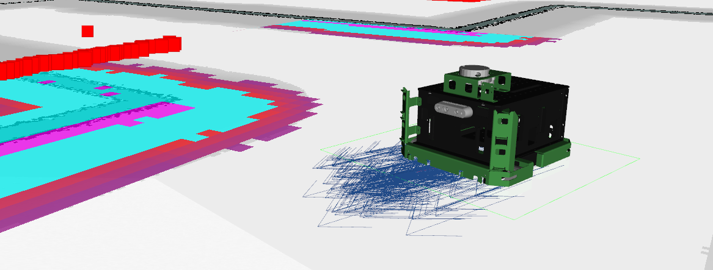

# MacBot - McMaster's MacBot ROS Stack



## macbot_description
Contains RViz configuration files, URDFs, and meshes. Textured and textureless variants. Textureless variant does not have sensors attached. 

===

## macbot_gazebo
Package for Gazebo Simulations. Contains world and their model files. Script for killall Gazebo launch.

##### Models
* maze
* maze_short_textured
* maze_textured

##### Launch 
* default.launch - Main launch file for launching Gazebo and RViz
    - model: robot_textured (default), robot_texturesless
    - world: empty (default), maze, contact_stability
    - rviz_config: sensors (default), mapping, navigation, robot
* teleop.launch - Keyboard teleop controls for driving the robot around

```
roslaunch macbot_gazebo default.launch world:=maze rviz_config:=navigation
```

===

## macbot_navigation
Navigation package utilizing ROS navigation stack. Contains configuration / parameter files for move_base package and maps.

##### Launch
* amcl.launch
* gmap.launch
* localization.launch

===

## macbot_physical
Physical package for interfacing with the MacBot. 

#### Launch
* diff_drive.launch - diff_drive node required for driving MacBot.

#### Nodes
* macbot_node.py - Communicating with the various nodes on the CAN bus.
* tf_broadcaster.py - Broadcasting the transforms of the left and right motorized wheels. 

===

## macbot_sensors
Package for launching one of the various sensors on the MacBot. 

#### Launch
* camera.launch - Intel RealSense
* lidar.launch - ydlidar
* sensors.launch - Launch all sensors

===