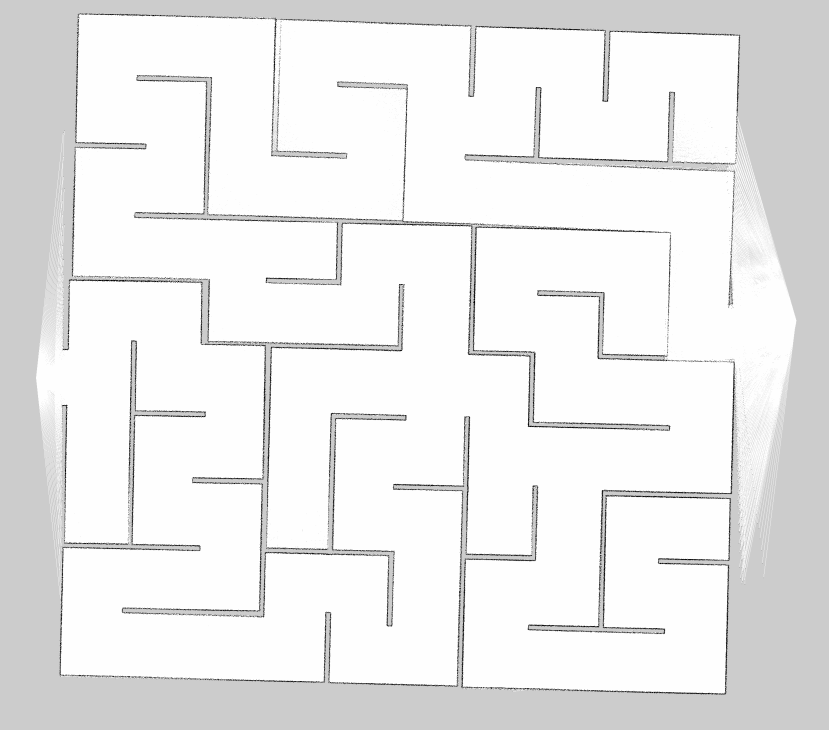
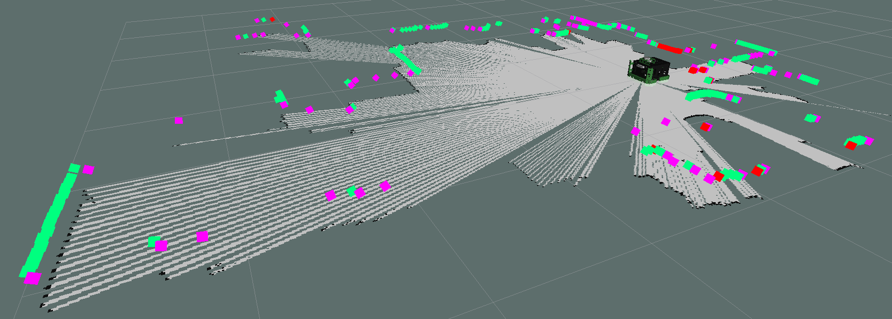

# Mapping
Mapping in both simulation and physically. There are different configurations for both scenarios. Mapping done with [gmapping](http://wiki.ros.org/gmapping). Mapping with [Google's cartographer](http://wiki.ros.org/cartographer) system is still a TODO and a future tentative implementation. 

## Simulation (gmapping)
To map solely in the Gazebo simulation, specify the world argument in the following launch command:

```
roslaunch macbot_gazebo default.launch world:=maze rviz_config:=mapping
```

In a separate tab, start the gmapping node so that can begin to build the map:

```
roslaunch macbot_navigation gmap.launch
```

To drive the robot in simulation with teleop, launch the following in the third tab:

```
roslaunch macbot_gazebo teleop.launch
```

When you're done mapping, save your map with the following command:
```
rosrun map_server map_saver -f ~/catkin_ws/src/macbot_navigation/map/mapname
```

Saved map file (.pgm) will look something as follows:


## Physical (gmapping)

To map with the actual MacBot, we'll launch the following:

```
roslaunch macbot_navigation gmap_macbot.launch
```

And then we'll drive the robot around to map the environment:
```
roslaunch macbot_physical diff_drive.launch
```

Save the map with the `map_server` node:
```
rosrun map_server map_saver -f ~/catkin_ws/src/macbot_navigation/map/mapname
```


