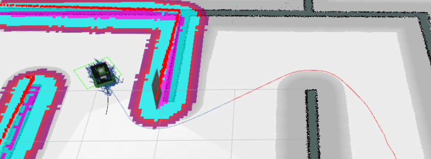

# Path Planning
Using the [move_base](http://wiki.ros.org/move_base) package from the ROS navigation stack. Will be using *global_planner* as our Global Planner. Files currently configured so that we will be using Dijkstra's alogrithm for our global path planning. Local planner will be using *dwa_local_planner*, or the Dynamic Window Approach algorithm. Configuration files are not fully optimized and there is room for improvement.

<blockquote>
```
<!-- GLOBAL PLANNERS // http://wiki.ros.org/nav_core -->
<!-- global_planner/GlobalPlanner // navfn/NavfnROS // carrot_planner/CarrotPlanner -->
<arg name = "base_global_planner"	default = "global_planner/GlobalPlanner"/>

<!-- LOCAL PLANNERS // http://wiki.ros.org/nav_core -->
<arg name = "base_local_planner"	default = "dwa_local_planner/DWAPlannerROS"/>
```
</blockquote>



## Simulation (move_base)
Launch the default launch file with the following arguments:

```
roslaunch macbot_gazebo default.launch world:=maze rviz_config:=navigation
```

Then in the second tab, launch the amcl node:

```
roslaunch macbot_navigation amcl.launch map_arg:=map_name
```

On RViz, go ahead and publish a *2D nav goal*. Sometimes the robot may get stuck navigating a corner. Publish another 2D nav goal to adjust the robot's position.